# Gallery

These figures parallel the Gleam Gallery, using the F# library and the same
source geometry. Run `scripts/generate-gallery-figures` from this repository.
The generator is a non-packable project under `tools/GalleryFigures`; it requires
no neighboring Gleam checkout. Panel framing is computed from F# geometry bounds.
Production arrangement capture and concurrent worker details are in
[COMMIT_CYCLE.md](COMMIT_CYCLE.md).

All twenty-nine figures are calculated by F#. The second-offset arrangement
captures production calls in a diagnostic-only build; no alternate solver is used.

### Rounded Rectangle Union

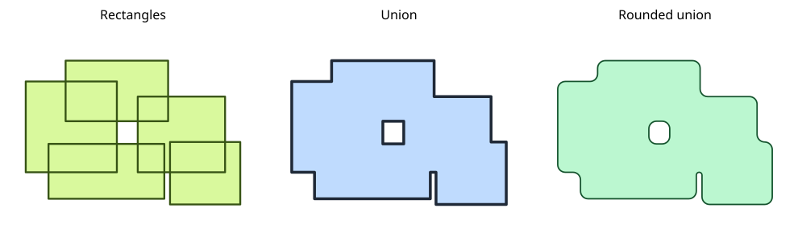

Shows a pile of overlapping rectangles, their raw `Nonzero` union, and the same
result after `Effects.roundCornersWith`.

### ArrangementGraph Intersection Studies

Each sheet shows the source operands, their shared arrangement graph, and the
reconstructed intersection boundary.

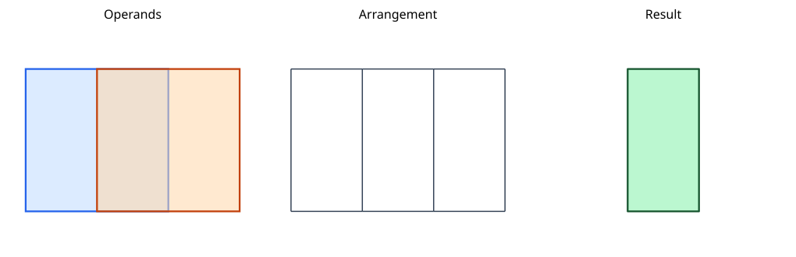

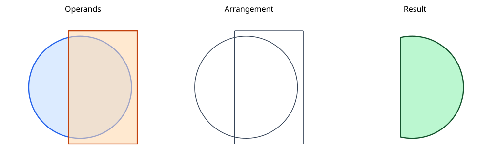

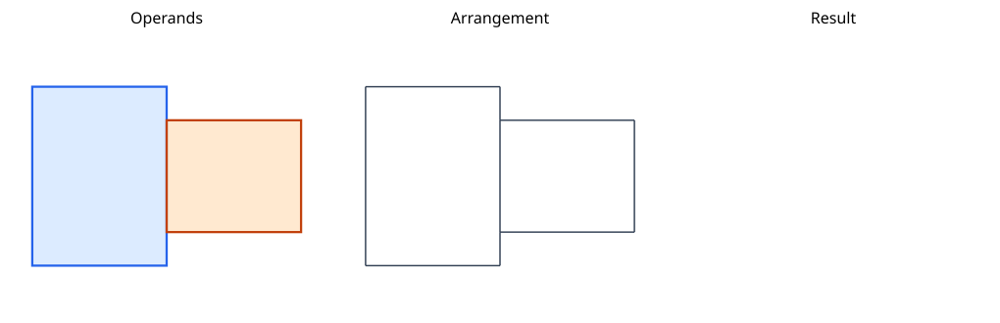

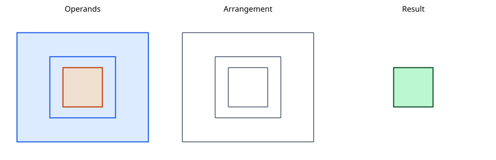

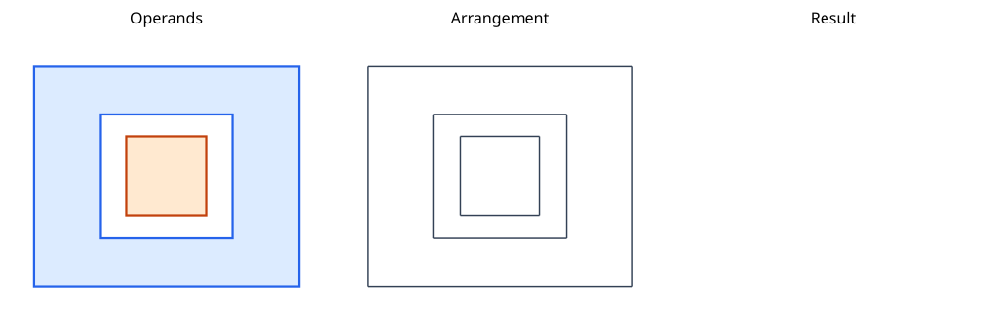

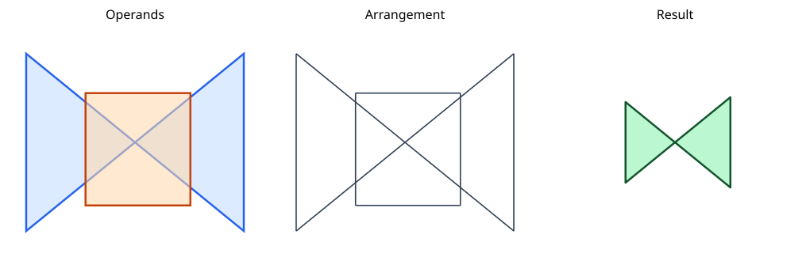

### ArrangementGraph Difference Studies

These use the same three-panel format for subtraction, including holes,
nested fill-rule cases, mixed curves, and self-crossing input.

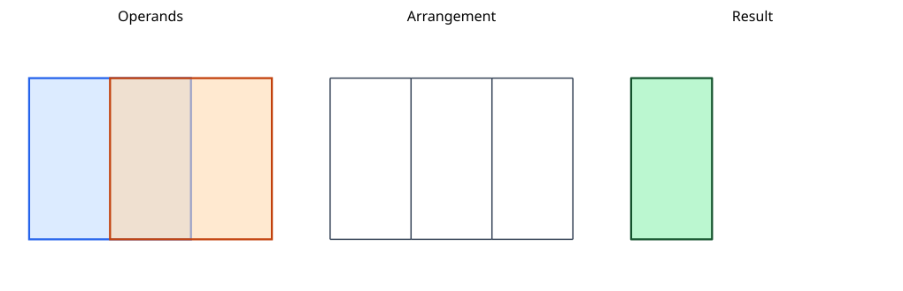

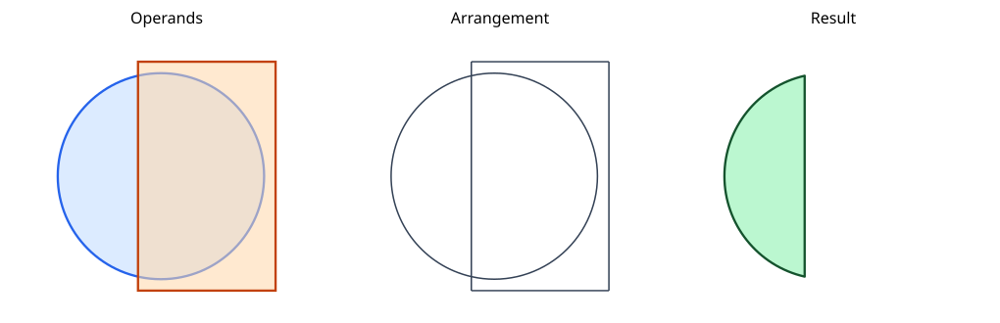

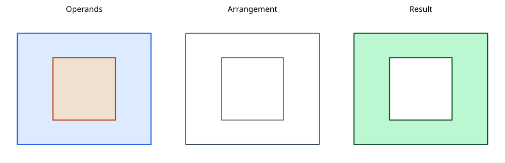

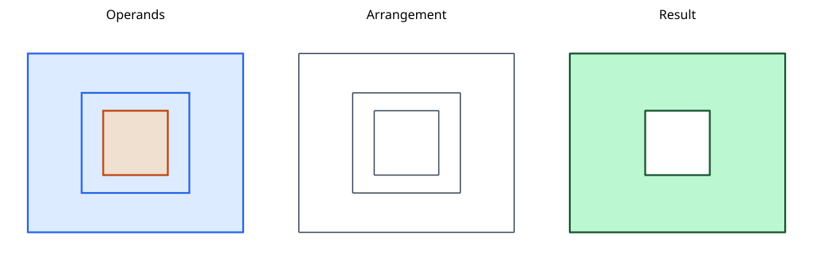

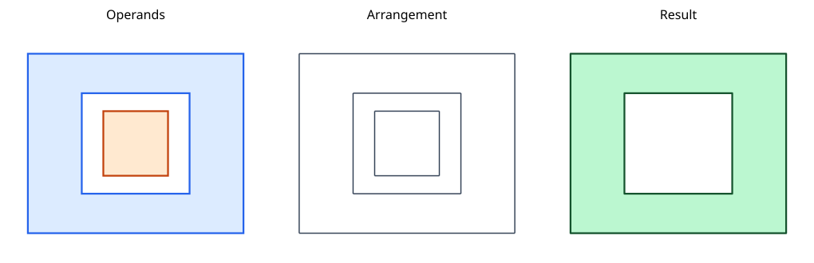

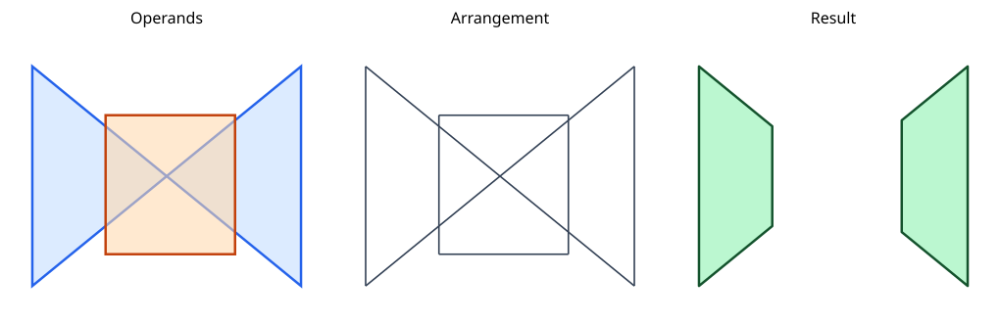

### Stroke Caps

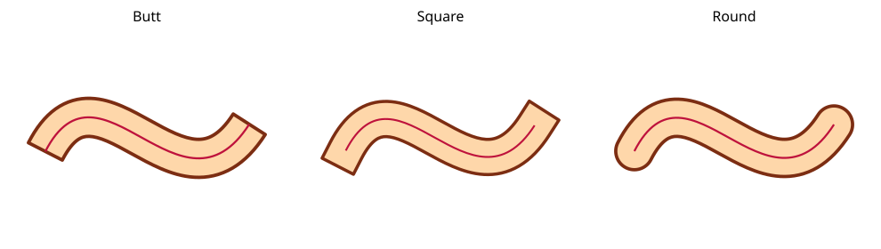

Shows the same open cubic stroked with butt, square, and round caps.

### Dashed Strokes

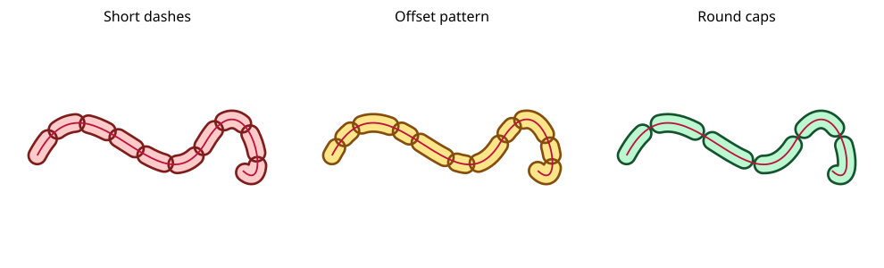

Shows SVG-style dash extraction followed by geometric stroking with round caps.

### Recursive Dashes

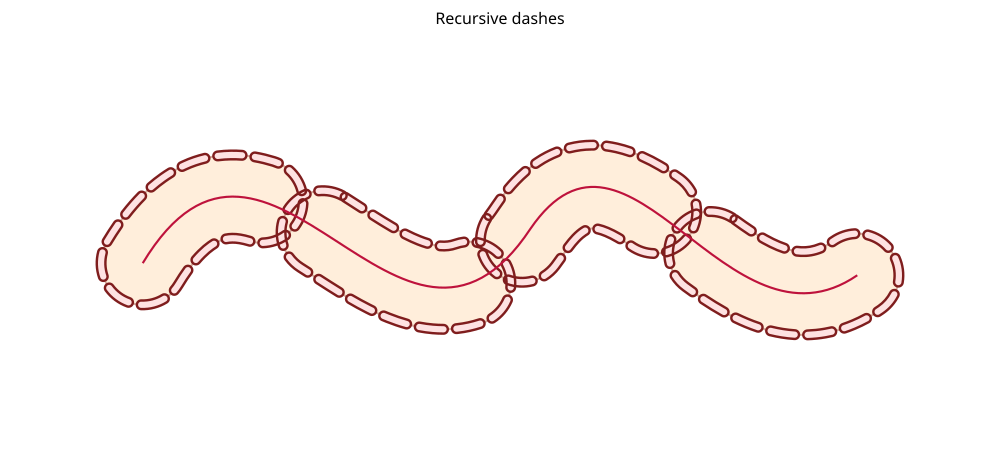

Shows a dashed stroke whose individual dash outlines are dashed and stroked
again at a smaller scale.

### Figure-Eight Band

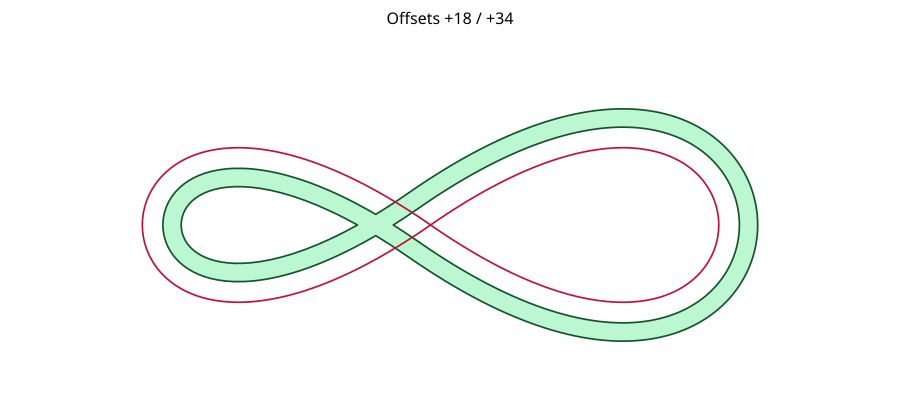

Shows an asymmetric two-sided band around a closed figure-eight.

### Stretched Figure-Eight Bands

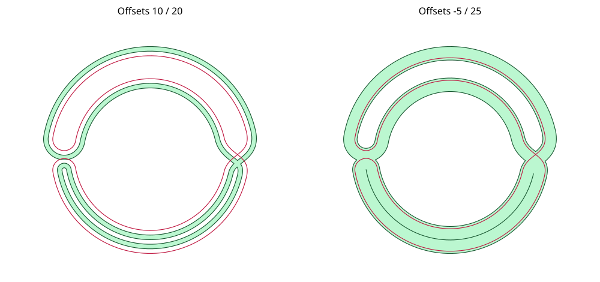

Compares a narrower band lying entirely on its positive-offset side (`+10` to
`+20`, left) with a wide band crossing both sides of the source (`−5` to `+25`,
right).

### Figure-Eight Correspondence Blocks

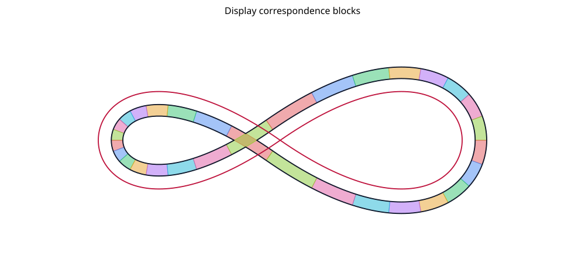

Shows the per-segment correspondence blocks between the untrimmed inner and
outer offset walks of the asymmetric figure-eight band.
This ports the current Gleam display fixture's endpoint-pairing heuristic;
these colored regions are not a certified provenance mapping.

### Figure-Eight Convex Hulls

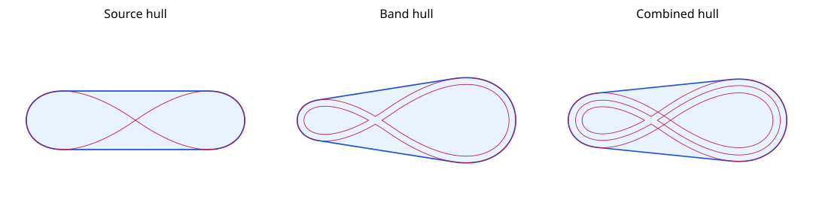

Compares the convex hulls of the Gallery figure-eight, its asymmetric band,
and the source and band taken together. These three cases are also numerical
regression fixtures for the convex-hull implementation.

### Stroke Offset Tracks

Shows one open subpath and several one-sided untrimmed offsets in different
colors.

### Earth-Tone Offsets

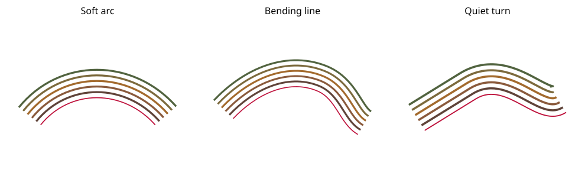

Shows three one-sided offset studies with each panel centered from the computed
geometry bounds.

### Package Title First Offset

Shows the package title outline, its untrimmed single offset, and the trimmed
single offset used to stress arrangement-based offset pruning.

### Package Title Second Offset Arrangement

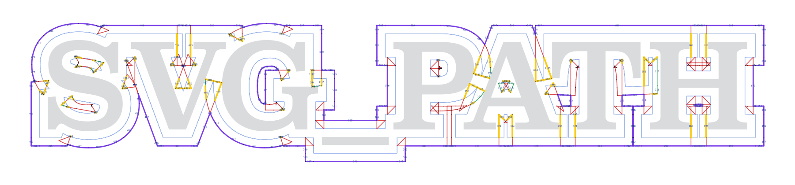

Shows the full arrangement from two successive `1.05` offsets using `Miter(4)`.
Only the second offset disables offside trimming. A diagnostic-only build
captures the actual classification and parity-reduction calls.

Red marks initially submerged offset edges; purple marks positive final
capacity. Yellow marks deleted edges that were initially degree-one after
submerged deletion. Green marks other initially retained edges later deleted;
pale gray marks source-only graph edges. Original lettering is pale gray and
its first offset is blue. The historical snapshot is retained under `archive`.

### Offset Text

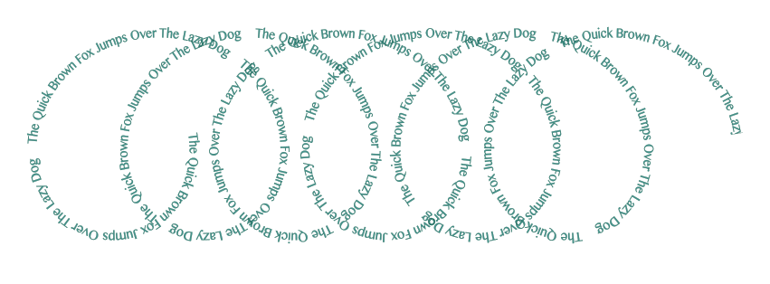

An included SVG text sample mapped into `(distance, offset)` space and then
onto a fixed-radius coil. The F# generator recomputes this geometry.

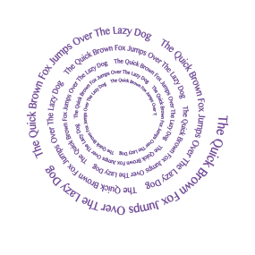

Uses the same text sample on a decaying spiral, with both radius and local
offset shrinking by the same factor per turn.

The F# generator recomputes this geometry from the same included text sample.

### Crescent Hull

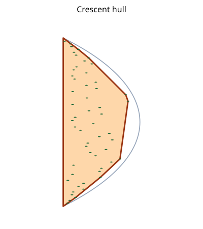

Shows a crescent-shaped point cloud, a reference arc and chord, and the computed
convex hull.

### Package Title Nine Offsets

Nine successive `Offset.path` rings, each spaced 1.04 from the previous ring,
pushed outward from the `SVG_PATH` text outline.

### Cut Radiator

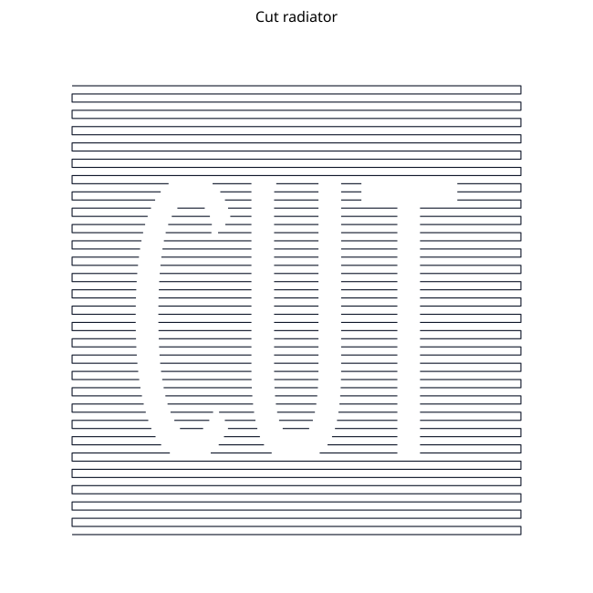

Shows a dense snaking subpath cut by a text outline, with the pieces inside the
outline removed.
